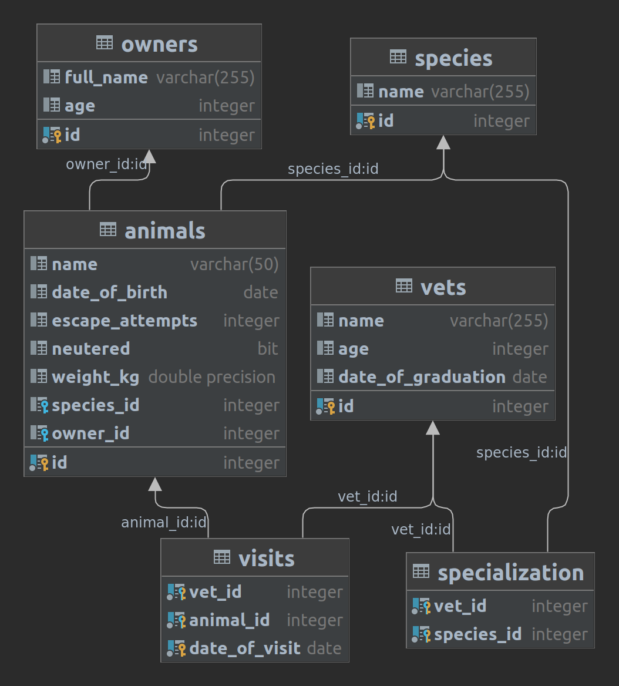

# Vet Clinic

This project is to practice relational database concepts creating a data structure for a vet clinic.

## Getting Started

This repository includes files with plain SQL that can be used to recreate a database:

- Use [schema.sql](./schema.sql) to create all tables.
- Use [data.sql](./data.sql) to populate tables with sample data.
- Check [queries.sql](./queries.sql) for examples of queries that can be run on a newly created database.

**Important note: this file might include queries that make changes in the database (e.g., remove records). Use them responsibly!**

---

To run a local copy of this project follow these simple steps:

### Prerequisites

- Any web browser (e.g. Google Chrome)
- Any Code Editor (e.g. Vscode)

### Cloning the repository

- Create a new folder.
- Open your console in the new folder and run this command: `git clone https://github.com/anagudelogu/vet-clinic.git`.
- Start recreating the database!

## Authors

👤 **Andres Agudelo**

- GitHub: [@anagudelogu](https://github.com/anagudelogu)
- Twitter: [@AgudeloAndres\_\_](https://twitter.com/AgudeloAndres__)
- LinkedIn: [Andres Agudelo Guzman](https://linkedin.com/in/aagst)

## 🤝 Contributing

Contributions, issues, and feature requests are welcome!

Feel free to check the [issues page](https://github.com/anagudelogu/vet-clinic/issues).

## Show your support

Give a ⭐️ if you like this project!

## 📝 License

This project is [MIT](./MIT.md) licensed.
